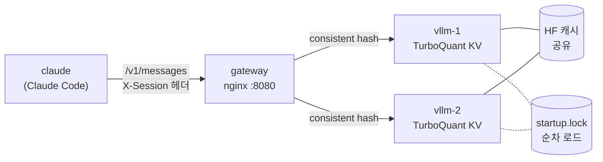

# 8.vllm_MultiLLM

> 게이트웨이(nginx) 단일 주소 뒤에 **vLLM 백엔드 N개**를 두고 Claude Code 다세션을 분산하는 예제. KV cache 는 vLLM 0.30 내장 **TurboQuant** 로 압축한다. [5.lms_MultiLLM](../5.lms_MultiLLM/README.md)(LM Studio)의 구조를 그대로 두고 백엔드만 vLLM 으로 바꿨다. vLLM 이미지는 fg1 `~/_git/__all/dockers/vllm_qwen38` 을 계승한다. 전체 예제 비교는 [상위 README](../README.md) 참조.

## 토폴로지



* **변환 프록시 없음** — vLLM 이 Anthropic Messages API(`/v1/messages`)를 직접 제공하므로 claude → gateway → vLLM 이 그대로 이어진다. 게이트웨이는 분산만 한다
* **세션 고정** — claude 셸마다 고유 `X-Session` 헤더를 붙이고(entrypoint.sh), 게이트웨이가 consistent hash 로 같은 백엔드에 고정한다. vLLM `--enable-prefix-caching` 과 맞물려 후속 턴의 프롬프트 재계산을 건너뛴다. 헤더가 없는 요청(curl 등)은 요청마다 랜덤으로 분산된다
    - ⚠️ upstream 을 `server vllm:8000 resolve;` 한 줄(서비스명이 N개 주소로 풀림)로 두면 hash 가 **라운드로빈으로 떨어진다** — fg1 실측에서 같은 X-Session 6회가 3:3 으로 갈렸다(nginx 1.27.5·1.30.3 동일). 복제본을 이름별 한 줄씩 나열하면 정상 고정된다. 그래서 `gateway-upstreams.sh` 가 기동 시 목록을 만든다
    - 복제본 수를 바꾸면 목록을 다시 만들어야 한다 — `start.sh` 가 매번 재생성 + `nginx -s reload` 한다
* **순차 로드** — GPU 1장을 나눠 쓰는 복제본이 동시에 뜨면 서로의 메모리 프로파일링을 오염시킨다. 공유 볼륨 flock 으로 «하나 로드 → `/health` 200 → 다음» 순서를 강제한다(entrypoint.vllm.sh)
* 기동 순서: vllm 전 복제본 healthy → gateway healthy(`/v1/models` 프록시 OK) → claude

## 구성

| 파일                      | 역할                                                                                                      |
| :------------------------ | :-------------------------------------------------------------------------------------------------------- |
| `docker-compose.yml`      | `gateway` + `vllm`(복제 `VLLM_REPLICAS`) + `claude` 3서비스, 내부 네트워크 `vllm`, 기동 게이팅            |
| `Dockerfile.vllm`         | `vllm/vllm-openai:v0.30.0-cu129` → torch·vLLM cu129 교체 + compat libcuda 제거 + GGUF 플러그인 + 기동 entrypoint |
| `entrypoint.vllm.sh`      | env 로 `vllm serve` 인자 조립, 복제본 기동 직렬화(flock), 폐쇄망 모드(`HF_HUB_OFFLINE`)                    |
| `Dockerfile.gateway`      | `nginx:1.27-bookworm` + curl — upstream `resolve` 에 1.27.3+ 필요                                         |
| `nginx.conf.template`     | X-Session consistent hash + SSE 패스스루 + `X-Upstream` 응답 헤더. upstream 목록은 아래 스크립트가 생성  |
| `gateway-upstreams.sh`    | 게이트웨이 기동 시 `vllm` 주소를 역조회해 복제본별 `server <이름>:8000 resolve;` 를 쓴다 (아래 «세션 고정») |
| `Dockerfile.claude`       | `debian:bookworm-slim` + Node.js 22 + Claude Code (5.lms_MultiLLM 과 동일)                                |
| `entrypoint.sh`           | claude PID1 — `settings.json`(게이트웨이 URL·프롬프트 다이어트 deny) 생성, 게이트웨이 대기, X-Session 주입 |
| `docker-compose.code.yml` | 호스트 코드 폴더(`MOUNT_CODE_DIR`) → `/home/ubuntu/code` 마운트 override (선택)                           |
| `.env.org`                | 기본 프리셋 — 소형 모델(Qwen3-4B FP8) 복제본 2개, 16GB GPU 1장                                            |
| `qwen38-27b.env.org`      | 대형 프리셋 — Qwen3.8-27B GGUF 3bit 복제본 1개 (vllm_qwen38 과 같은 모델·설정)                            |
| `start.sh`                | GPU·드라이버·메모리 비율 합 점검 후 `docker compose up -d --build --scale vllm=N`                         |
| `test.sh`                 | 8단계 종단 점검 (아래 «점검»)                                                                             |
| `chat.sh`                 | 게이트웨이 경유 스트리밍 채팅 + tok/s·응답 백엔드 표시 (`SESSION=` 으로 세션 고정)                        |
| `clear.sh`                | 컨테이너 정리 (`--volumes` 면 named volume 까지)                                                          |

## 사용법

```bash
cd 8.vllm_MultiLLM
cp .env.org .env                 # 27B 단일: cp qwen38-27b.env.org .env
vi .env                          # VLLM_MODEL, VLLM_REPLICAS, GPU_MEMORY_UTILIZATION, KV_CACHE_DTYPE

./start.sh                       # 빌드 + 기동. 전 복제본이 healthy 가 될 때까지 블록됨
./start.sh 3                     # 이번만 복제본 3개

./test.sh                        # 종단 점검
./chat.sh "질문"                 # 스트리밍 채팅 (응답 백엔드 표시)

docker exec -it vllm-claude bash
cc                               # alias = claude --dangerously-skip-permissions

docker compose logs -f vllm      # 복제본 로그 (순차 로드 진행 확인)
./clear.sh                       # 정리
```

* `start.sh` 는 compose 의 `depends_on: service_healthy` 때문에 **모든 복제본 로드가 끝날 때까지 돌아오지 않는다**(소형 2개 약 6분, 27B 1개 약 7분 + 첫 기동 다운로드). 다른 터미널에서 `docker compose logs -f vllm` 로 진행을 본다
* 첫 기동은 모델을 HF 에서 받는다. 복제본이 HF 캐시를 공유하고 순차 로드라 같은 모델을 두 번 받지 않는다

## 주요 변수 (`.env`)

| 변수                       | 기본값 (`.env.org`)                | 설명                                                                         |
| :------------------------- | :--------------------------------- | :--------------------------------------------------------------------------- |
| `VLLM_MODEL`               | `Qwen/Qwen3-4B-Instruct-2507-FP8`  | HF repo id 또는 GGUF `<repo>:<quant>`                                        |
| `SERVED_MODEL_NAME`        | `qwen3-4b`                         | API 모델명 — claude 의 `ANTHROPIC_MODEL`·haiku 대체 모델로도 전달            |
| `TOOL_CALL_PARSER`         | `hermes`                           | Qwen3 Instruct → `hermes`, Qwen3.5·3.8·Coder → `qwen3_coder`, 빈값=tool 끔   |
| `REASONING_PARSER`         | (빈값)                             | thinking 모델이면 `qwen3`                                                    |
| `VLLM_REPLICAS`            | `2`                                | 백엔드 수 (`./start.sh N` 이 우선)                                           |
| `GPU_MEMORY_UTILIZATION`   | `0.45`                             | 복제본 1개의 GPU 메모리 비율 — 복제본 수 × 비율 ≤ 0.9 (start.sh 가 점검)     |
| `VLLM_STARTUP_LOCK`        | `1`                                | 복제본 순차 로드 (0 이면 동시 — GPU 분할 시 비권장)                          |
| `KV_CACHE_DTYPE`           | `turboquant_4bit_nc`               | `auto`·`turboquant_k8v4`·`turboquant_4bit_nc`·`turboquant_k3v4_nc`·`turboquant_3bit_nc` |
| `MAX_MODEL_LEN`            | `32768`                            | 컨텍스트 상한 — Claude Code 는 시스템 프롬프트만 3k~19k 토큰                 |
| `MAX_NUM_SEQS`             | `4`                                | 복제본당 동시 시퀀스                                                         |
| `MAX_NUM_BATCHED_TOKENS`   | `2048`                             | prefill 청크 크기 (27B 는 512)                                               |
| `CPU_OFFLOAD_GB`           | `0`                                | 가중치 초과분 CPU 오프로드 (느려짐)                                          |
| `VLLM_EXTRA_ARGS`          | (빈값)                             | 추가 `vllm serve` 인자 — 공백이 있으면 큰따옴표로 감쌀 것                    |
| `HF_CACHE_DIR`             | `~/.cache/huggingface`             | 모델 캐시 — 빈값이면 named volume `hf-cache`                                 |
| `VLLM_CACHE_DIR`           | `~/.cache/vllm`                    | torch.compile 캐시 — 빈값이면 named volume `vllm-cache`                      |
| `VLLM_OFFLINE`             | `0`                                | `1` = HF 접속 차단 (폐쇄망 필수, 모델이 캐시에 있어야 함)                    |
| `GATEWAY_PORT`             | `8080`                             | 게이트웨이 호스트 포트                                                       |
| `CLAUDE_MAX_OUTPUT_TOKENS` | `8192`                             | input+output 이 `MAX_MODEL_LEN` 안에 들어가야 함                             |
| `CLAUDE_EFFORT_LEVEL`      | `medium`                           | Claude Code 추론 effort → vLLM `reasoning_effort`. Qwen3.8 은 `low·medium·xhigh` 만 허용 |
| `CLAUDE_DIET`              | `1`                                | 프롬프트 다이어트 (WebSearch·WebFetch 는 항상 deny)                          |
| `NVIDIA_DISABLE_REQUIRE`   | `1`                                | 구형 드라이버 우회 (드라이버 575+ 면 `0`)                                    |

## TurboQuant

KV cache 를 WHT 회전 + Lloyd-Max 양자화로 압축한다. **가중치는 줄이지 않는다** — 이득은 같은 VRAM 에서 더 긴 컨텍스트·더 많은 동시 시퀀스다.

| 프리셋               | K    | V    | 비고       |
| :------------------- | :--- | :--- | :--------- |
| `turboquant_k8v4`    | FP8  | 4bit | 품질 우선  |
| `turboquant_4bit_nc` | 4bit | 4bit | **기본값** |
| `turboquant_k3v4_nc` | 3bit | 4bit |            |
| `turboquant_3bit_nc` | 3bit | 3bit | 최대 압축  |

* GPU 1장을 복제본 여럿이 나누는 이 예제에서 특히 효과가 크다 — 복제본당 VRAM 이 작아 KV 예산이 빠듯하기 때문이다(아래 실측)
* hybrid(linear + full attention) 모델(Qwen3.5·3.8)은 KV 비중이 원래 작아 이득이 상대적으로 작다

## 구형 드라이버 (fg1: 525.105, CUDA 12.0)

공식 cu129 이미지는 내부 torch 가 cu130 이라 525 드라이버에서 실행되지 않는다. `Dockerfile.vllm` 재빌드와 compose env 로 우회한다(출처 vllm_qwen38).

| 문제                                         | 대응                                                 | 위치       |
| :------------------------------------------- | :--------------------------------------------------- | :--------- |
| torch cu130 → CUDA 13 실행 불가              | torch 2.13.0 cu129 + vLLM 0.30.0+cu129 wheel 로 교체 | Dockerfile |
| `cuda>=12.9` 요구 검사로 기동 거부           | `NVIDIA_DISABLE_REQUIRE=1`                           | compose    |
| compat libcuda 로드 시 error 803             | `/usr/local/cuda*/compat` 제거                       | Dockerfile |
| `named symbol not found`                     | `CUDA_MODULE_LOADING=LAZY`                           | compose    |
| FlashInfer sampler `kernel image is invalid` | `VLLM_USE_FLASHINFER_SAMPLER=0`                      | compose    |

## 점검

```bash
./test.sh                 # 전체
SKIP_CLAUDE=1 ./test.sh   # Claude Code 종단(8) 생략
```

| #   | 항목                       | 판정                                                          |
| :-- | :------------------------- | :------------------------------------------------------------ |
| 1   | 복제본 상태                | 전 복제본 `(healthy)`                                         |
| 2   | TurboQuant 적용            | 기동 로그 `kv_cache_dtype` = `.env` 값, KV 토큰 수 출력       |
| 3   | 게이트웨이 `/v1/models`    | `SERVED_MODEL_NAME` 노출                                      |
| 4   | OpenAI `/v1/chat/completions` | 응답에 `PONG`                                              |
| 5   | Anthropic `/v1/messages`   | `"type":"message"` + `PONG` — Claude Code 가 쓰는 경로        |
| 6   | 분산                       | 헤더 없는 요청 12회가 2곳 이상으로 (`X-Upstream` 헤더 집계)   |
| 7   | 세션 고정                  | 세션 4개 각각 같은 `X-Session` 8회가 한 백엔드로              |
| 8   | Claude Code 응답           | `claude -p` → `PONG`, «컨텍스트 200k 가정» 경고 없음          |
| 9   | Claude Code tool call      | Write 도구로 파일 생성 → 내용 `TOOL_OK` 확인                  |

* 어느 백엔드가 받았는지는 응답 헤더 `X-Upstream` 으로 보인다 — `curl -si localhost:8080/v1/models | grep -i x-upstream`

## 실측 (fg1 · RTX 16GB · 드라이버 525 · 2026-10-08)

| 항목                          | 소형 ×2 (`.env.org`)                               | 27B ×1 (`qwen38-27b.env.org`) |
| :---------------------------- | :------------------------------------------------- | :---------------------------- |
| 모델                          | Qwen3-4B-Instruct-2507-FP8                         | Qwen3.8-27B GGUF UD-IQ3_S     |
| 복제본당 가중치               | 4.32 GiB                                           | 11.86 GiB (GGUF IQ3_S)                     |
| 복제본당 KV (TurboQuant 4bit) | 35,520 / 48,160 tokens (먼저 뜬 쪽 / 나중 쪽)      | **65,536 tokens** (32k 요청 2개 동시)                     |
| GPU 메모리 합                 | 14.0 GiB / 16 GiB                                  | 14.7 GiB / 16 GiB                     |
| 기동 시간 (전 복제본 healthy) | 첫 기동 약 6분 / 재기동 약 2분 (compile 캐시 재사용) | 약 6분 30초 (가중치 로드 5분 24초)                     |
| 단일 요청 생성 속도           | 54 tok/s                                           | 17 tok/s (300 tokens / 17.9초)                     |
| 8세션 동시 (300 tokens 씩)    | 18.1초 — 집계 **133 tok/s**                        | —                             |
| test.sh                       | 9/9 PASS                                           | 9/9 PASS (6단계는 백엔드 1개라 생략 판정)                     |

* 같은 KV 메모리를 bf16(`auto`)로 쓰면 복제본당 약 11~15k 토큰(Qwen3-4B 토큰당 144 KiB)이라 `MAX_MODEL_LEN=32768` 이 들어가지 않는다 — TurboQuant 가 있어야 16GB 1장에 32k 컨텍스트 복제본 2개가 성립한다
* 8세션 동시에서 한 백엔드에 5세션이 몰려 1개가 대기했다(`MAX_NUM_SEQS=4`) — 세션 수가 많으면 `MAX_NUM_SEQS` 를 올리되 KV 토큰 예산 안에서 정한다

## 폐쇄망(air-gap) 메모

* 빌드는 온라인 머신에서 한다 — `Dockerfile.vllm` 이 torch·vLLM wheel·GGUF 플러그인을, `Dockerfile.claude` 가 npm 을 받는다
* 반입물: 이미지 3종(`vllm-turboquant:v0.30.0-cu129`·`vllm-gateway:latest`·`vllm-claude:latest`)을 `docker save` 로, 모델은 `HF_CACHE_DIR` 디렉토리 통째로(심볼릭링크 구조 유지 — `tar` 로 묶는다). 반입 후 `.env` 에 `VLLM_OFFLINE=1`
* `docker export`/`import` 는 ENTRYPOINT·ENV 를 잃으므로 쓰지 않는다 — 상세 절차는 [5.lms_MultiLLM README](../5.lms_MultiLLM/README.md) «반입 전 반드시 알아야 할 4가지» 와 같다
* `GGUF_CUDA_ARCH=8.9`(Ada)로 GGUF 커널을 빌드한다 — 다른 세대 GPU 면 빌드 인자를 바꿔 재빌드

## 알려진 한계

* **게이트웨이 SPOF** — 게이트웨이 1개 장애 = 전체 다운
* **동일 모델 전제** — 전 복제본이 같은 모델이라 nginx 패스스루로 충분하다. 백엔드마다 다른 모델을 라우팅하려면 body 의 `model` 을 보는 라우터(LiteLLM 등)가 필요하다
* **GPU 분할 정밀도** — `GPU_MEMORY_UTILIZATION` 은 GPU 전체 대비 비율이다. 다른 프로세스가 GPU 를 쓰고 있으면 뒤 복제본이 «free memory 부족» 으로 기동에 실패한다
* **소형 모델의 에이전트 품질** — 4B 급은 단답·단일 tool call 은 되지만 계산·긴 tool-use 루프는 불안정하다(실측: `17*23` 에 `401` 로 오답). 실사용은 27B 프리셋 또는 더 큰 GPU 를 권장한다
* **effort 계약** — Claude Code 는 모르는 모델에도 `output_config.effort: "high"` 를 보내고, vLLM 은 이를 `reasoning_effort` 로 chat template 에 넘긴다. Qwen3.8 템플릿은 `xhigh·medium·low` 만 받아 `high` 면 `400 Unexpected reasoning effort high` 로 끊긴다(fg1 실측). compose 가 `CLAUDE_CODE_EFFORT_LEVEL=${CLAUDE_EFFORT_LEVEL:-medium}` 을 넘겨 맞춘다 — 다른 모델로 바꾸면 그 템플릿이 받는 값을 확인할 것
* **Claude Code 카탈로그 밖 모델** — 2.1.29x 는 모르는 모델명에 `[claude-code:unrecognized_model]` 진단 한 줄을 남긴다(정보성). 컨텍스트 창은 compose 가 `CLAUDE_CODE_MAX_CONTEXT_TOKENS=${MAX_MODEL_LEN}` 으로 넘긴다 — 빠지면 200k 로 가정해 auto-compact 가 늦게 돈다
